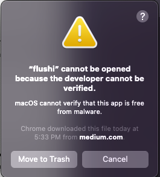

to flush the DNS cache on MacOSX is very annoyed because you need to google to find the command that is something that is not easy to remind, then you need to open terminal.app and then you need to execute the command.

I decided to develop a simple app that can help you to flush DNS cache on Mac.

The APP is called FLUSHI and you can download for free from here https://hackmike.com/static/flushi.zip

if you get this error during the installation

go to setting > security & privacy and click open anyway

          

when you click on the app you get this pop-up where you need to type your root password
          

then you click on flush dns

if you type the wrong message you will get this msg
          

APP has been tested on MacOSX Monterey

